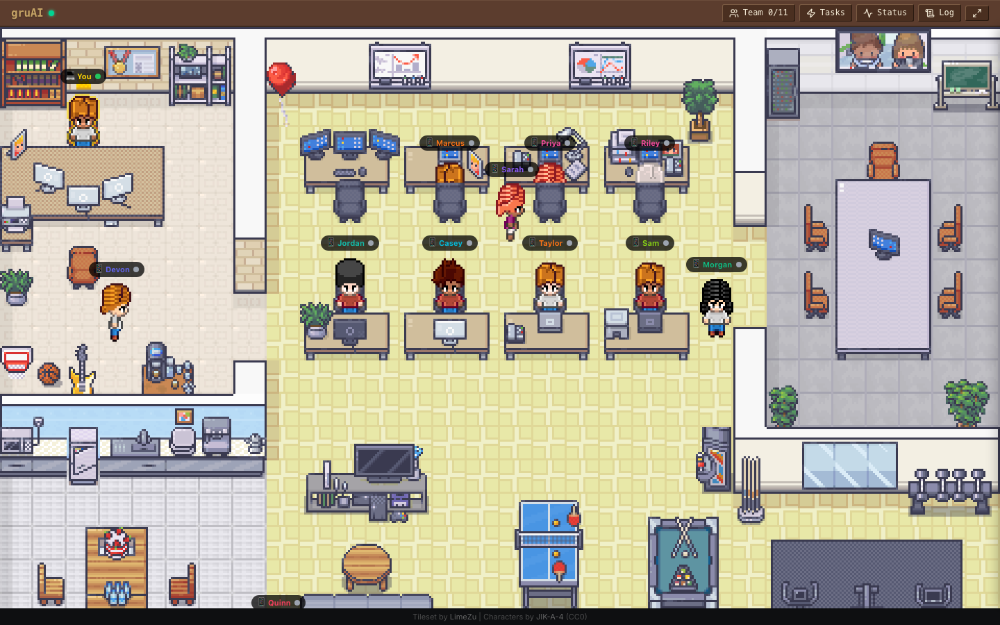
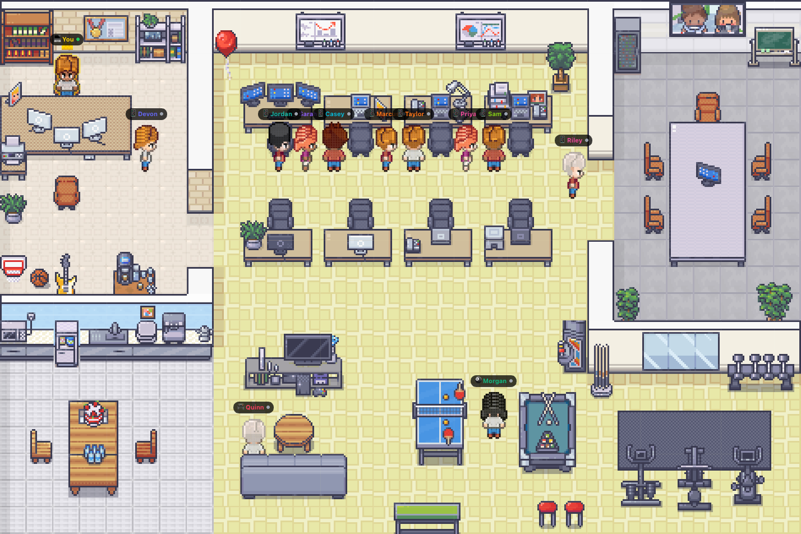

<!-- TODO: CEO — capture hero GIF showing the pixel-art office with agents walking, typing, and reviewing code in real time. ~10 seconds, 720px wide. -->
<p align="center">
  
</p>

<h1 align="center">gruAI</h1>

<p align="center">
  <strong>An autonomous AI company in your terminal. You run the company. Agents build, review, and ship the code.</strong>
</p>

<p align="center">
  <a href="LICENSE"></a>
  <a href="https://www.typescriptlang.org/"></a>
  <a href="https://www.npmjs.com/package/gru-ai"></a>
  <a href="#"></a>
</p>

---

## What Is gruAI?

Most AI coding tools put you in the driver's seat -- prompting, reviewing, re-prompting, clarifying, re-clarifying. You become a full-time AI babysitter.

gruAI flips this. You are the CEO. You hand down a directive ("add dark mode to the dashboard"), and a team of named AI agents handles the rest:

1. Your CTO audits the codebase. C-suite agents **brainstorm approaches, argue trade-offs, and challenge your assumptions** -- then clarify with you before anyone writes code.
2. Your COO decomposes the work, assigns builders and reviewers. Engineers build. Reviewers review with fresh context. A mechanical gate blocks shipping until all reviews pass.
3. You get a digest: files changed, tests passed, review summary. Approve or reopen.

The system is designed for **depth, not speed.** Every directive flows through a 15-step pipeline grounded in Anthropic's [evaluator-optimizer pattern](https://www.anthropic.com/research/building-effective-agents) -- agents build, reviewers evaluate, issues get fixed in-loop, not after the fact. This is how output quality is guaranteed, not hoped for.

Agents accumulate institutional memory across directives -- lessons learned, design rationale, standing corrections. Your 10th directive runs better than your 1st because the team remembers what went wrong.

---

## How the Pipeline Works

Every piece of work -- from fixing a typo to redesigning a subsystem -- flows through a structured pipeline. The weight system adapts automatically: lightweight tasks skip brainstorming and auto-approve; heavyweight tasks get the full process with CEO review gates.

This isn't ceremony for ceremony's sake. Each phase exists because [skipping it caused failures in production](https://www.anthropic.com/engineering/building-c-compiler) -- Anthropic's research on building a C compiler found that **harness quality determines output quality**, not model intelligence. [OpenAI reached the same conclusion](https://openai.com/index/harness-engineering/): environment design outweighs prompt engineering.

```mermaid
graph LR
    subgraph Intake
        T[Triage] --> CK[Checkpoint] --> R[Read]
    end
    subgraph Analysis
        R --> CX[Context] --> AU[Audit] --> BR[Brainstorm]
    end
    subgraph Planning
        BR --> CL[Clarification] --> PL[Plan] --> AP[Approve]
    end
    subgraph Execution
        AP --> PB[Project<br/>Brainstorm] --> SU[Setup] --> EX[Execute]
    end
    subgraph Verification
        EX --> RG[Review<br/>Gate] --> WU[Wrapup] --> CO[Completion]
    end

    style T fill:#4a9eff,color:#fff
    style AP fill:#ff6b6b,color:#fff
    style RG fill:#ff6b6b,color:#fff
    style CO fill:#ff6b6b,color:#fff
```



**Red nodes = hard gates.** Approve requires CEO sign-off (heavyweight/strategic only). Review Gate blocks completion until all reviews pass. Completion requires CEO confirmation -- no directive auto-ships.

### Weight Adaptation

Not every task needs the full process. The pipeline classifies directives by weight and adapts:

| Weight | Example | What Changes |
|--------|---------|-------------|
| **Lightweight** | Fix a typo, update a config value | Skips brainstorm, auto-approves plan |
| **Medium** | Add a feature, refactor a module | Skips brainstorm, auto-approves plan |
| **Heavyweight** | Multi-system feature, new subsystem | Full pipeline with CEO gates |
| **Strategic** | Architecture migration, new platform | Full pipeline + deliberation round + CEO STOP gates at Clarification and Approve |

Lightweight and medium directives still run audit, clarification, code review, and the review gate. Every step that was "skipped for efficiency" eventually caused a production failure -- the cost of running lightweight steps is small; the cost of skipping them is rework.

### Worked Example: "Rewrite the README with research citations"

This README was itself built through the pipeline as a **strategic** directive -- full brainstorm, CEO gates, the works:

| Step | What Happens |
|------|-------------|
| **Triage** | Classified as **strategic** -- involves external research, cross-domain content decisions |
| **Audit** | CTO (Sarah) identifies 10 messaging gaps and 3 existing assets in the current README |
| **Brainstorm** | CTO, CPO, and CMO independently propose approaches, then **argue trade-offs in a deliberation round**. All 3 reject "revolutionary" language. They disagree on line count (150 vs 400) and resolve at 250-350. They surface 3 questions for the CEO. |
| **Clarification** | CEO reviews the synthesized intent, answers the 3 questions, adds constraint: "multi-platform is roadmap, not shipped" |
| **Plan** | COO casts Taylor (content) as builder, Priya (CMO) as reviewer |
| **Execute** | Taylor researches 7 competitors, verifies citation URLs. Then writes the full README. Priya [reviews with fresh context](https://www.anthropic.com/engineering/effective-context-engineering-for-ai-agents) -- no builder reasoning, just the output. |
| **Review Gate** | validate-reviews.sh confirms: no self-review, all 10 DOD criteria verified by Priya |
| **Completion** | CEO reviews the digest: approve, amend, or reopen |

> For lighter work (e.g., "fix a typo"), the pipeline skips brainstorming and auto-approves -- same verification, less ceremony.

---

## Meet Your Team

gruAI ships with 11 agents organized into 4 teams. Each has a name, personality, domain expertise, and persistent memory.

| Agent | Role | Domain | Team |
|-------|------|--------|------|
| **You** | CEO | Direction, reviews, approvals | -- |
| Sarah Chen | CTO | Architecture, security, code quality | C-Suite |
| Marcus Rivera | CPO | Product strategy, UX, prioritization | C-Suite |
| Morgan Park | COO | Planning, orchestration, agent casting | C-Suite |
| Priya Sharma | CMO | Growth, SEO, positioning | C-Suite |
| Jordan Okafor | Backend Engineer | Server, API, database | Engineering |
| Casey Liu | Data Engineer | Pipelines, indexing, state | Engineering |
| Devon Lee | Full-Stack Engineer | Cross-domain work | Engineering |
| Riley Kim | Frontend Engineer | React, Tailwind, components | Product |
| Quinn Torres | UI/UX Designer | Design review, wireframes | Product |
| Sam Nakamura | QA Engineer | Testing, validation, edge cases | Product |
| Taylor Reeves | Content Builder | MDX, copywriting, documentation | Growth |

C-Suite agents have **institutional memory** -- they accumulate lessons, design rationale, and standing corrections across directives. Engineers are spawned per-task with fresh context, scoped to exactly what they need.

Agents are markdown files in `.claude/agents/`. Add your own by creating a new file -- the dashboard and pipeline will detect it automatically.

---

## gruAI vs Agent Frameworks

| Feature | gruAI | CrewAI | LangGraph | Google ADK | AutoGen | OpenAI SDK | Devin | Manus |
|---------|-------|--------|-----------|------------|---------|------------|-------|-------|
| **License** | MIT | MIT | MIT | Apache 2.0 | MIT | MIT | Proprietary | Proprietary |
| **Cost** | Free | Free / $25+ | Free / $39+ | Free | Free | Free | $20-500+/mo | $39-199/mo |
| **Open Source** | Yes | Yes | Yes | Yes | Yes | Yes | No | No |
| **Built-in Pipeline** | 15-step with weight adaptation | No (user-defined chains) | No (user-built graphs) | No (user-defined) | No (conversation loops) | No (handoff-based) | Internal (closed) | Internal (closed) |
| **Code Review** | 3-layer: code review, standard review, review gate | None | None | None | None | None | Internal | None |
| **Institutional Memory** | Lessons, design docs, standing corrections | No | No | No | No | No | Limited | No |
| **Agent Personalities** | Named agents with domains and persistent identity | Role descriptions | None | None | None | None | Single agent | Single agent |
| **Visual Dashboard** | Session kanban + pixel-art office | None | LangSmith (paid) | None | AutoGen Studio | Traces API | Web IDE | Web IDE |
| **Runs Locally** | Yes (reads ~/.claude/) | Yes | Yes | Yes | Yes | Yes | No (cloud) | No (cloud) |
| **Primary Use Case** | Autonomous software company | Business workflow automation | Stateful agent graphs | Multi-modal agent toolkit | Distributed agent systems | Lightweight agent handoffs | Cloud coding agent | General productivity |

---

## Dashboard and Office

<!-- TODO: CEO — capture screenshot of the full dashboard showing session kanban, activity panel, and agent cards. 1200px wide. -->
<p align="center">
  
</p>

The dashboard monitors all active Claude Code sessions in real time:

- **Session kanban** -- cards grouped by status (active, idle, waiting for approval, completed)
- **Activity feed** -- live stream of tool calls, file edits, and agent actions
- **Terminal focus** -- one click jumps to any session's terminal pane (iTerm2, Warp, tmux)
- **Approval actions** -- approve or reject permission prompts without leaving the dashboard
- **Multi-repo support** -- discovers all conductor-enabled repos in `~/.claude/projects/`

<!-- TODO: CEO — capture screenshot or short GIF of the pixel-art office with agents at desks, walking, and at the whiteboard. 720px wide. -->
<p align="center">
  
</p>

Your agents have a pixel-art office. Every animation is tied to real session state -- when an agent starts a code review, you see them walk to the reviewer's desk. When they're idle, they sit at their workstation. When they're waiting for approval, they stand up and look at you. It's functional monitoring with personality.

---

## Quickstart

```bash
git clone https://github.com/andrew-yangy/gruai.git
cd gruai && npm install
npm run dev
```

Open [http://localhost:5173](http://localhost:5173) to see the dashboard and office.

Then scaffold your AI team:

```
# In Claude Code, run the skill:
/gruai-agents
```

This creates agent personality files in `.claude/agents/`, a context tree in `.context/`, and a starter directive you can run immediately with `/directive`.

Or install as an npm package: `npm install gru-ai && npx gru-ai`

gruAI currently works with **Claude Code**. Adapters for Codex CLI, Gemini CLI, and Aider are planned -- the pipeline and dashboard are engine-agnostic by design.

---

<details>
<summary><strong>Terminal Support</strong></summary>

Session discovery works on any OS. Terminal focus requires OS integration:

| Environment | Focus | Send Input | Notes |
|-------------|:-----:|:----------:|-------|
| iTerm2 + tmux | Yes | Yes | AppleScript + tmux pane switching |
| iTerm2 native | Yes | Yes | AppleScript with session ID |
| Warp + tmux | Yes | Yes | CGEvents + tmux |
| Warp native | Yes | No | CGEvents tab navigation |
| Terminal.app + tmux | Yes | Yes | Bring to front + tmux |

Linux and Windows support coming soon.

</details>

<details>
<summary><strong>Claude Code Hooks</strong></summary>

gruAI works without hooks. For instant status detection (permission prompts,
idle states), add hooks to `~/.claude/settings.json`:

```json
{
  "hooks": {
    "Notification": [
      {
        "matcher": "permission_prompt",
        "hooks": [
          {
            "type": "command",
            "command": "bash -c 'INPUT=$(cat); curl -s -X POST http://localhost:4444/api/events -H \"Content-Type: application/json\" -d \"{\\\"type\\\":\\\"permission_prompt\\\",\\\"sessionId\\\":\\\"$(echo $INPUT | jq -r .session_id)\\\",\\\"message\\\":\\\"$(echo $INPUT | jq -r .message)\\\"}\"'"
          }
        ]
      }
    ],
    "Stop": [
      {
        "hooks": [
          {
            "type": "command",
            "command": "bash -c 'INPUT=$(cat); curl -s -X POST http://localhost:4444/api/events -H \"Content-Type: application/json\" -d \"{\\\"type\\\":\\\"stop\\\",\\\"sessionId\\\":\\\"$(echo $INPUT | jq -r .session_id)\\\"}\"'"
          }
        ]
      }
    ]
  }
}
```

Without hooks, status updates via filesystem scanning (slight delay). With hooks,
updates are instant.

</details>

<details>
<summary><strong>Scripts</strong></summary>

```bash
npm run dev          # Dev mode (server + client with hot reload)
npm run dev:server   # Server only (port 4444)
npm run dev:client   # Vite dev only
npm start            # Production server (serves built assets)
npm run build        # Production build
npm run type-check   # TypeScript check
npm run lint         # ESLint
```

</details>

<details>
<summary><strong>Claude Code Skills</strong></summary>

```
/gruai-agents        # Scaffold AI agent team with personalities and roles
/gruai-config        # Update framework files to latest version
/directive           # Run work through the directive pipeline
/report              # CEO dashboard report
/healthcheck         # Internal codebase health check
/scout               # External intelligence gathering
```

</details>

<details>
<summary><strong>Tech Stack</strong></summary>

| Layer | Stack |
|-------|-------|
| Server | Node.js + WebSocket + SQLite + chokidar |
| Frontend | React 19 + Vite + Zustand + Tailwind v4 + shadcn/ui |
| Game | Canvas 2D pixel-art engine, 16x16 tile system |
| Terminal | AppleScript (iTerm2) + CGEvents (Warp) + tmux CLI |
| Data | Zero external services -- reads from `~/.claude/` locally |

</details>

<details>
<summary><strong>Research References</strong></summary>

The pipeline design draws from published research by Anthropic and OpenAI:

- [Building Effective Agents](https://www.anthropic.com/research/building-effective-agents) (Anthropic, Dec 2024) -- six composable agent patterns; start with simple workflows, add complexity only when needed
- [Effective Context Engineering](https://www.anthropic.com/engineering/effective-context-engineering-for-ai-agents) (Anthropic, Sep 2025) -- context rot begins at 8K-16K tokens; progressive disclosure and sub-agent architectures as mitigations
- [Multi-Agent Research System](https://www.anthropic.com/engineering/multi-agent-research-system) (Anthropic, Jun 2025) -- multi-agent outperformed single-agent by 90.2%; token usage explained 80% of performance variance
- [Building a C Compiler](https://www.anthropic.com/engineering/building-c-compiler) (Anthropic, Feb 2026) -- test harness quality is the steering mechanism; environment design > instructions
- [Harness Engineering](https://openai.com/index/harness-engineering/) (OpenAI, Feb 2026) -- 3 engineers + Codex produced 1M lines; environment design outweighs prompt engineering
- [Practices for Governing Agentic AI Systems](https://openai.com/index/practices-for-governing-agentic-ai-systems/) (OpenAI, Dec 2023) -- capability boundaries, human review gates, trust hierarchies
- [Codified Context](https://arxiv.org/abs/2602.20478) (ArXiv, Feb 2026) -- hot-memory + specialized agents + cold-memory knowledge base pattern

</details>

---

[MIT](LICENSE)
