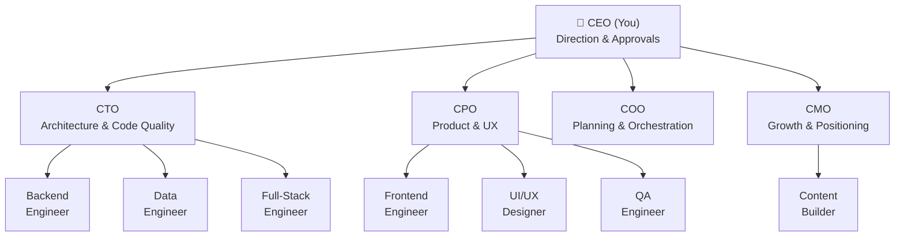

<h1 align="center">gruAI</h1>

<h3 align="center">Stop coding with AI.<br/>Start running an AI team.</h3>

<p align="center">
  <a href="LICENSE"></a>
  <a href="https://www.typescriptlang.org/"></a>
  <a href="https://www.npmjs.com/package/gru-ai"></a>
  <a href="#"></a>
</p>

<p align="center">
  <a href="#what-is-gruai">What Is gruAI?</a> •
  <a href="#the-pipeline">The Pipeline</a> •
  <a href="#the-context-tree">Context Tree</a> •
  <a href="#why-is-the-output-better">Why It Works</a> •
  <a href="#your-team">Your Team</a> •
  <a href="#quickstart">Quickstart</a>
</p>

<p align="center">
  <video src="docs/assets/demo.mp4" width="720" autoplay loop muted playsinline>
    
  </video>
</p>

---

## What Is gruAI?

### Most AI tools help you code faster. gruAI lets you stop coding entirely.

You run your AI team just like a CEO, and the agents handle the rest: engineering, marketing, operations, and more. You hand down a directive ("add dark mode to the dashboard"). Your agents brainstorm the approach, challenge your assumptions, build, review each other's work, and ship — you approve the result.

The system is designed for **depth, not speed.** Agents accumulate institutional memory across directives — lessons learned, design rationale, standing corrections. Your 10th directive runs better than your 1st because the team remembers what went wrong.

**You make decisions. Agents make software.** Every directive flows through a 15-step pipeline — triage, audit, brainstorm, plan, build, review, and ship — grounded in published research from Anthropic and OpenAI on what actually makes AI output reliable.

**gruAI is right for you if:**

✅ You want to give direction, not instructions — be the CEO, not the prompt engineer
✅ You're tired of the prompt-review-reprompt loop and want agents that get it right the first time
✅ You want agents that brainstorm, challenge your assumptions, and debate before writing a single line of code
✅ You want mandatory code review and mechanical verification, not optional "looks good to me"
✅ You want institutional memory — agents that learn from mistakes and carry lessons across every task
✅ You want a structured pipeline backed by context engineering research, not ad-hoc prompting
✅ You coordinate specialized roles (CTO, COO, CPO, CMO, engineers) not generic "AI assistants"
✅ You want to watch your autonomous company run from a pixel-art office dashboard

---

## The Pipeline

You say *"add a payment system."* The pipeline takes it from here — 15 steps across 5 phases.

| Icon | Meaning |
|:----:|---------|
| :gear: | **System step** — automated, no agent or human involved |
| :busts_in_silhouette: | **Agent step** — one or more AI agents do the work |
| :diamond_shape_with_a_dot_inside: | **CEO gate** — pipeline pauses for your decision |

### Phase 1: Intake

| # | Step | Who | What Happens |
|:-:|------|:---:|-------------|
| 1 | :gear: **Triage** | System | Classifies your directive by weight: lightweight, medium, heavyweight, or strategic. *"Add a payment system"* spans API, database, and UI — classified **heavyweight**. [Start simple, add complexity only when needed.](https://www.anthropic.com/research/building-effective-agents) |
| 2 | :gear: **Checkpoint** | System | Checks for prior progress. If a session died mid-execution, it reads `directive.json` and [resumes from the last completed step](https://www.anthropic.com/engineering/building-c-compiler) — no work is lost. |
| 3 | :gear: **Read** | System | Parses your directive brief, creates structured metadata, and extracts your Definition of Done. |

### Phase 2: Analysis

| # | Step | Who | What Happens |
|:-:|------|:---:|-------------|
| 4 | :gear: **Context** | System | Loads lessons, design docs, and intel — [scoped to what this directive needs](https://www.anthropic.com/engineering/effective-context-engineering-for-ai-agents), not a 200K-token dump. |
| 5 | :busts_in_silhouette: **Audit** | QA Engineer, then CTO | Two-agent sequential audit. QA scans the codebase (pure facts: which files, what state, what breaks). Then the CTO recommends approaches. Identifies existing API patterns, database schema, and security considerations. |
| 6 | :busts_in_silhouette: **Brainstorm** | CTO + CPO + CMO | C-suite agents independently propose approaches, then [deliberate and argue](https://www.anthropic.com/engineering/multi-agent-research-system). CTO pushes for Stripe, CPO argues for simpler in-house billing, CMO flags pricing page implications. They surface 3 questions for you. |

### Phase 3: Planning

| # | Step | Who | What Happens |
|:-:|------|:---:|-------------|
| 7 | :diamond_shape_with_a_dot_inside: **Clarification** | System → **CEO confirms** | Synthesizes intent from your brief, audit findings, and brainstorm. Surfaces conflicts and gaps. **You answer the 3 questions** — catching misalignment here costs one interaction instead of a full reopen. |
| 8 | :busts_in_silhouette: **Plan** | COO | Decomposes the directive into projects, assigns agents and reviewers. Payment system → 2 projects: backend engineer builds API + database, frontend engineer builds UI. CTO reviews both. |
| 9 | :diamond_shape_with_a_dot_inside: **Approve** | **CEO reviews plan** | **You review the plan** before any code is written. [Human review at trust boundaries only](https://www.anthropic.com/engineering/building-c-compiler) — you gate the plan and the result, not every step in between. |

### Phase 4: Execution

| # | Step | Who | What Happens |
|:-:|------|:---:|-------------|
| 10 | :busts_in_silhouette: **Project Brainstorm** | CTO + assigned builder | Break each project into concrete tasks with Definition of Done criteria. Dark mode gets 4 tasks: theme provider, component migration, toggle UI, persistence. |
| 11 | :gear: **Setup** | System | Creates a git branch to isolate changes. |
| 12 | :busts_in_silhouette: **Execute** | Assigned builders + reviewers | Builders work through tasks. After each task, a [separate reviewer evaluates with fresh context](https://www.anthropic.com/research/building-effective-agents) — no builder reasoning, no confirmation bias. Failed review triggers a fix cycle. |

### Phase 5: Verification

| # | Step | Who | What Happens |
|:-:|------|:---:|-------------|
| 13 | :gear: **Review Gate** | System | Bash scripts — not LLMs — [mechanically verify](https://openai.com/index/harness-engineering/) that every task was reviewed by a different agent, every DOD criterion was evaluated, and review artifacts exist. |
| 14 | :gear: **Wrapup** | System | Updates lessons and design docs. Generates a CEO digest with files changed, review results, and revert commands. [Knowledge persists](https://arxiv.org/abs/2602.20478) for future directives. |
| 15 | :diamond_shape_with_a_dot_inside: **Completion** | **CEO** | **Mandatory for all weights.** You review the digest and decide: approve (ship it), amend (fix specific issues), or reopen (start over). The pipeline never ships without your sign-off. |

### Weight Adaptation

| Weight | Example | Skips | CEO Gates |
|--------|---------|-------|-----------|
| **Lightweight** | Fix a typo | Brainstorm | Completion only |
| **Medium** | Add dark mode | Brainstorm | Completion only |
| **Heavyweight** | New payment system | Nothing | Clarification + Approve + Completion |
| **Strategic** | Platform migration | Nothing | Clarification + Approve + Completion |

---

## The Context Tree

All state lives in `.context/` at your repo root — plain markdown and JSON, version-controlled alongside your code.

```
.context/
├── directives/              # All work lives here
│   └── dark-mode/
│       ├── directive.json   # Pipeline state, weight, progress
│       ├── directive.md     # CEO brief
│       ├── audit.md         # CTO's technical audit
│       ├── brainstorm.md    # C-suite deliberation
│       └── projects/
│           └── dark-mode/
│               └── project.json  # Tasks, DOD, agents, reviews
├── lessons/                 # What went wrong (reactive)
├── design/                  # Why the system works this way (proactive)
├── intel/                   # External research from /scout
└── reports/                 # CEO digests
```

**Directive → Projects → Tasks.** A directive is a unit of work ("add dark mode"). The COO decomposes it into projects, each with tasks, agents, reviewers, and a Definition of Done. `directive.json` tracks pipeline progress — any session can read it and resume where it left off. `project.json` is the source of truth for what needs building and whether it passed review.

**Knowledge compounds.** Lessons, design rationale, and standing corrections persist across directives. Agents load relevant context just-in-time — not everything, just what they need for their role and task. No database, no external service — just files.

---

## Why Is the Output Better?

Every point below traces to published research from Anthropic and OpenAI. This isn't a workflow we invented — it's assembled from what the research says actually works.

- **Agents brainstorm and argue before anyone writes code.** For strategic directives, your C-suite agents independently propose approaches, then deliberate — challenging assumptions, resolving disagreements, and surfacing questions for you. Anthropic's research found [multi-agent outperformed single-agent by 90.2%](https://www.anthropic.com/engineering/multi-agent-research-system). The pipeline implements their [orchestrator-workers pattern](https://www.anthropic.com/research/building-effective-agents) where specialized agents collaborate, producing better results than any single agent.

- **Reviewers evaluate intent, not just code.** Each reviewer gets [fresh context](https://www.anthropic.com/engineering/effective-context-engineering-for-ai-agents) scoped to the task — they never see the builder's reasoning, preventing confirmation bias. They verify against your Definition of Done (what you asked for), not just whether the code compiles. This is Anthropic's [evaluator-optimizer pattern](https://www.anthropic.com/research/building-effective-agents): one agent generates, another evaluates, issues get fixed in-loop — not after the fact.

- **Context is isolated, not accumulated.** Each agent spawns with a [clean context window](https://www.anthropic.com/engineering/effective-context-engineering-for-ai-agents) scoped to exactly what it needs. No 200K-token sessions where the model forgets what it read at the start. Anthropic's context engineering research shows accuracy degrades as token count increases — gruAI treats context as a finite resource under active degradation.

- **Verification is mechanical.** Bash scripts — not LLMs — enforce pipeline integrity: schema validation, self-review prevention, step dependency checks, role assignment verification. This follows Anthropic's [poka-yoke principle](https://www.anthropic.com/research/building-effective-agents) (error-proof design) and OpenAI's finding that [invariants should be enforced through structural tests](https://openai.com/index/harness-engineering/), not judgment.

- **The harness determines output quality, not model intelligence.** Anthropic found that ["the task verifier must be nearly perfect, otherwise the agent solves the wrong problem"](https://www.anthropic.com/engineering/building-c-compiler). OpenAI's team reached the same conclusion: [3 engineers produced 1M lines of code](https://openai.com/index/harness-engineering/) not by writing better prompts, but by designing better environments and feedback loops. gruAI's 15-step pipeline IS that harness.

- **Memory compounds across directives.** Lessons, design rationale, and standing corrections persist in `.context/` and get loaded into every future agent. This implements the [codified context pattern](https://arxiv.org/abs/2602.20478) — hot-memory + specialized agents + cold-memory knowledge base.

---

## Your Team

gruAI ships with 11 customizable agents. You are the CEO — everyone reports to you.



C-suite agents have **institutional memory** — lessons and corrections persist across directives. Engineers spawn per-task with fresh context. All agents are markdown files in `.claude/agents/` — add, rename, or customize freely.

---

## Quickstart

In your project folder:

```bash
npx gru-ai init       # Scaffolds .context/, agents, and pipeline
npx gru-ai start      # Launches dashboard on localhost:4444
```

Then in Claude Code, run `/directive` to start your first directive.

### Platform Support

| Platform | Pipeline | Dashboard | Session Monitoring | Status |
|----------|:--------:|:---------:|:------------------:|--------|
| **Claude Code** | :white_check_mark: | :white_check_mark: | :white_check_mark: | **Production** — fully tested |
| **Codex CLI** | :construction: | :x: | :x: | Spawn adapter built, not yet integrated |
| **Gemini CLI** | :construction: | :x: | :x: | Spawn adapter built, experimental |
| **Aider** | :construction: | :x: | :x: | Spawn adapter built, experimental |
| **Cursor / Cline** | :x: | :x: | :x: | Planned |

The pipeline and dashboard are engine-agnostic by design — platform adapters handle the differences.

---

<details>
<summary><strong>Terminal Support</strong></summary>

| Environment | Focus | Send Input | Notes |
|-------------|:-----:|:----------:|-------|
| iTerm2 + tmux | Yes | Yes | AppleScript + tmux pane switching |
| iTerm2 native | Yes | Yes | AppleScript with session ID |
| Warp + tmux | Yes | Yes | CGEvents + tmux |
| Warp native | Yes | No | CGEvents tab navigation |
| Terminal.app + tmux | Yes | Yes | Bring to front + tmux |

Linux and Windows support coming soon.

</details>

<details>
<summary><strong>Claude Code Hooks</strong></summary>

gruAI works without hooks. For instant status detection (permission prompts, idle states), add hooks to `~/.claude/settings.json`:

```json
{
  "hooks": {
    "Notification": [
      {
        "matcher": "permission_prompt",
        "hooks": [
          {
            "type": "command",
            "command": "bash -c 'INPUT=$(cat); curl -s -X POST http://localhost:4444/api/events -H \"Content-Type: application/json\" -d \"{\\\"type\\\":\\\"permission_prompt\\\",\\\"sessionId\\\":\\\"$(echo $INPUT | jq -r .session_id)\\\",\\\"message\\\":\\\"$(echo $INPUT | jq -r .message)\\\"}\"'"
          }
        ]
      }
    ],
    "Stop": [
      {
        "hooks": [
          {
            "type": "command",
            "command": "bash -c 'INPUT=$(cat); curl -s -X POST http://localhost:4444/api/events -H \"Content-Type: application/json\" -d \"{\\\"type\\\":\\\"stop\\\",\\\"sessionId\\\":\\\"$(echo $INPUT | jq -r .session_id)\\\"}\"'"
          }
        ]
      }
    ]
  }
}
```

</details>

<details>
<summary><strong>Scripts</strong></summary>

```bash
npm run dev          # Dev mode (server + client with hot reload)
npm run dev:server   # Server only (port 4444)
npm run dev:client   # Vite dev only
npm start            # Production server (serves built assets)
npm run build        # Production build
npm run type-check   # TypeScript check
npm run lint         # ESLint
```

</details>

<details>
<summary><strong>Claude Code Skills</strong></summary>

```
/gruai-agents        # Scaffold AI agent team with personalities and roles
/gruai-config        # Update framework files to latest version
/directive           # Run work through the directive pipeline
/report              # CEO dashboard report
/healthcheck         # Internal codebase health check
/scout               # External intelligence gathering
```

</details>

<details>
<summary><strong>Tech Stack</strong></summary>

| Layer | Stack |
|-------|-------|
| Server | Node.js + WebSocket + SQLite + chokidar |
| Frontend | React 19 + Vite + Zustand + Tailwind v4 + shadcn/ui |
| Game | Canvas 2D pixel-art engine, 16x16 tile system |
| Terminal | AppleScript (iTerm2) + CGEvents (Warp) + tmux CLI |
| Data | Zero external services -- reads from `~/.claude/` locally |

</details>

<details>
<summary><strong>Research References</strong></summary>

- [Building Effective Agents](https://www.anthropic.com/research/building-effective-agents) (Anthropic, Dec 2024) — evaluator-optimizer, orchestrator-workers, poka-yoke
- [Effective Context Engineering](https://www.anthropic.com/engineering/effective-context-engineering-for-ai-agents) (Anthropic, Sep 2025) — context rot, progressive disclosure, sub-agent isolation
- [Multi-Agent Research System](https://www.anthropic.com/engineering/multi-agent-research-system) (Anthropic, Jun 2025) — 90.2% multi-agent improvement, token usage = 80% of variance
- [Building a C Compiler](https://www.anthropic.com/engineering/building-c-compiler) (Anthropic, Feb 2026) — harness quality > model intelligence
- [Harness Engineering](https://openai.com/index/harness-engineering/) (OpenAI, Feb 2026) — 3 engineers + Codex = 1M lines, structural invariants
- [Codified Context](https://arxiv.org/abs/2602.20478) (ArXiv, Feb 2026) — hot-memory + specialized agents + cold-memory knowledge base

</details>

---

[MIT](LICENSE)
